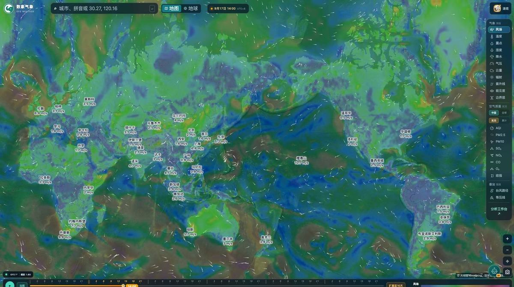
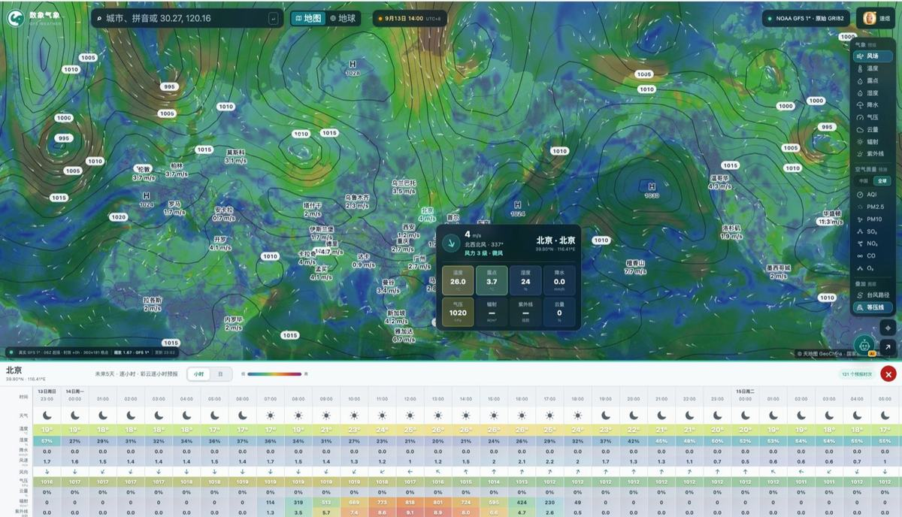
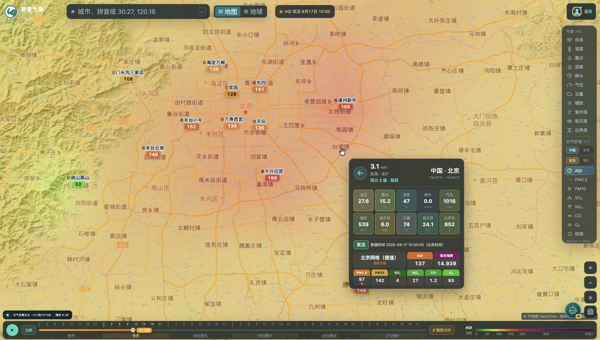
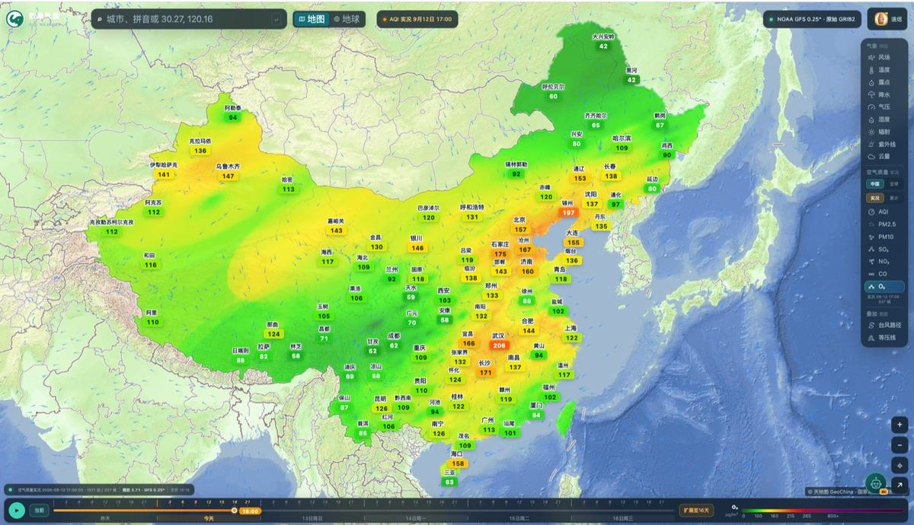
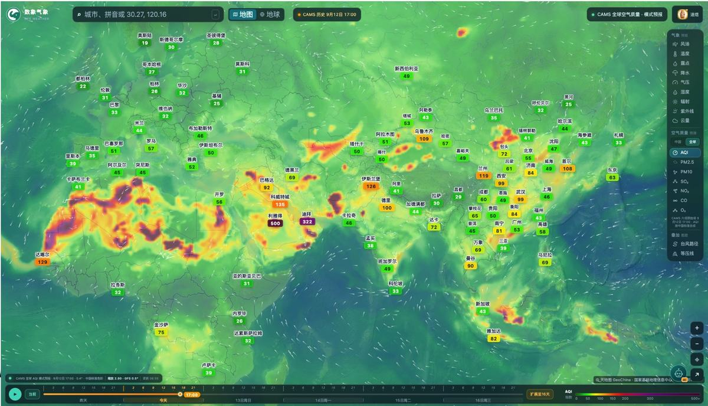
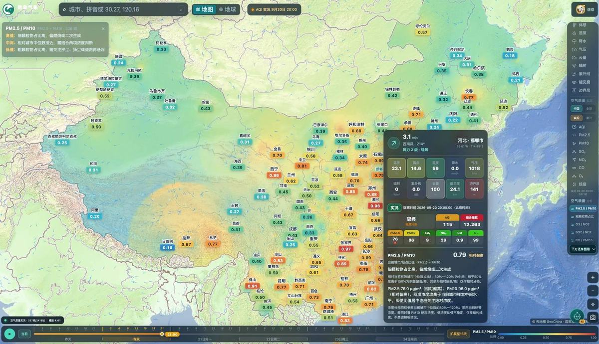
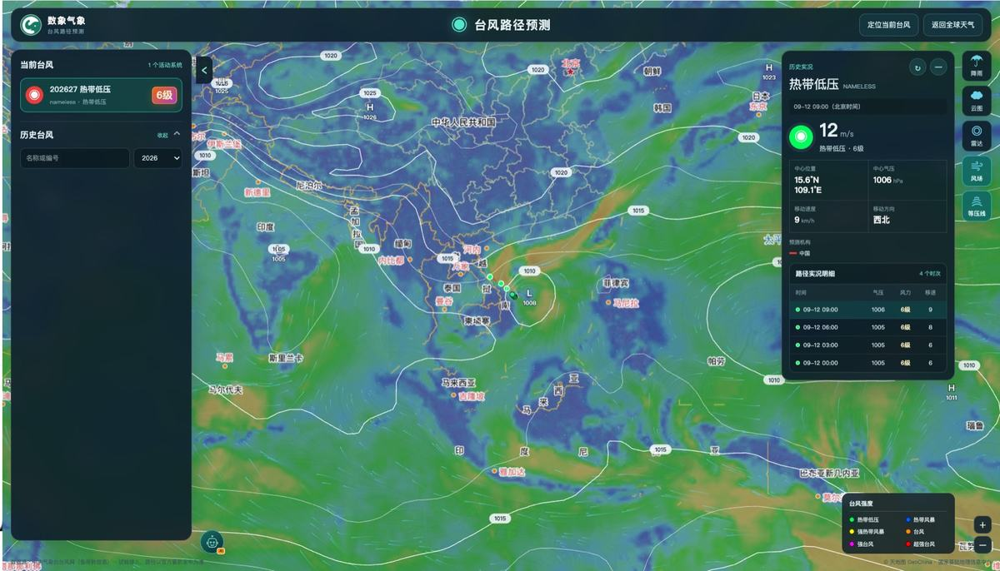
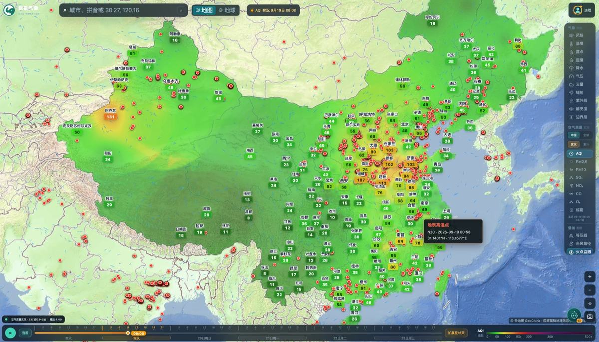
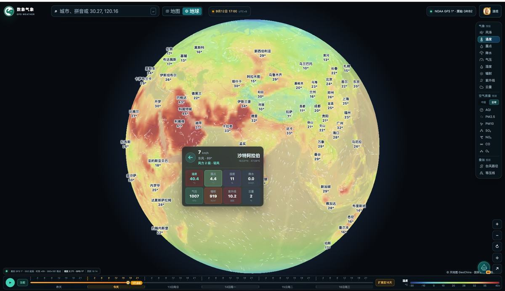
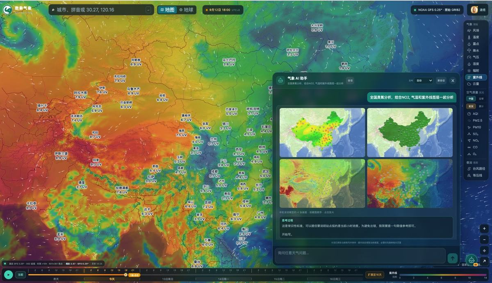

# 数象气象 · sxmap

**把全球大气数据，做成随时可查的在线地图**

全球天气 · 空气质量 · 台风路径 · 卫星火点，一屏之内都能看

## 这是什么

数象气象（sxmap）是一个**在线运行的全球天气与空气质量可视化平台**，浏览器打开就能用，不需要下载、安装或注册插件。

它把通常散落在不同工具里的三类信息，放到同一张可以随时缩放、拖动、按时间播放的地图上：

| 维度 | 能查到什么 |
| --- | --- |
| **全球气象** | GFS 0.25° 全球网格，未来 **120 小时逐小时**与 **16 天逐日**预报 |
| **空气质量** | 中国站点实况、历史与 48 小时预测；全球模式网格 |
| **灾害与事件** | 台风实时与历史路径、多机构路径预报对比、当日卫星火点 |

> **打开即用：<https://sxmap.zq12369.com/>**

---

## 一屏之内能看到什么

进入首页后，右侧是图层切换面板，底部是时间轴，中间就是地图本身。所有查询都围绕这一屏展开。

### 气象图层 · 12 项

风场、温度、露点、体感、湿度、降水、气压、云量、辐射、紫外线、能见度、边界层。

每个图层都是一张全球色场，配独立图例与色阶；切换图层不会丢失当前观看的位置与时间。

### 空气质量图层 · 8 项

AQI、PM2.5、PM10、SO₂、NO₂、CO、O₃ 与综合指数。

中国站点口径支持**实况 / 历史 / 48 小时预测**三种时态切换，站点实测与网格插值在页面上分别标注。

### 空气质量结构分析 · 5 项

PM2.5 / PM10、粗颗粒物占比、O₃ / NO₂、SO₂ / NO₂、CO / PM2.5 —— 用五项结构比值，回答「这口空气里主要是什么」。

### 更多图层

台风路径、当日卫星火点，可叠加在当前视野上。

---

## 功能详情

### 1. 全球气象地图

以 0.25° 的全球预报网格铺底，十二项气象要素随时刻连续变化。地图支持无级缩放与平移，从半球尺度一路下钻到城市与区县；顶部搜索框可以按**城市名、拼音或经纬度**定位。

风场图层用流线表现风向与风速，城市标签同步给出读数——上方首屏截图即是这一图层。

### 2. 城市与区县预报查询

搜索城市、区县或全球主要城市，点开即可查看**未来 120 小时逐小时**与**未来 16 天逐日**预报，包含气温、降水、风况等要素。地图上的城市标签会同步显示当前图层对应的读数，例如切到风场就显示风速，切到 AQI 就显示空气质量指数。

### 3. 全国任意位置网格查询

不止城市。输入经纬度，或直接在地图上点选，把查询落到**具体坐标**——项目所在地、园区周边、郊野与沿途位置都能查看气象网格读数与空气质量插值估算，让城市平均值之外的空间差异也有迹可循。选区后同样显示行政区划边界。

### 4. 中国空气质量

八项空气质量图层覆盖中国大陆站点实测。城市标签与悬浮读数同步给出各项浓度，便于把污染分布和风场放在一起对照：看一眼风向与浓度梯度，就能判断是本地累积还是上游输送。

支持**实况、历史回看与 48 小时预测**，切换时页面会如实标注数据口径。

### 5. 全球空气质量

把视野拉到全球尺度，用模式网格看跨境传输与沙尘过程。中国站点实测与全球模式各有清晰来源，切换时分别标注口径，让不同尺度的环境信息在同一张地图上衔接。

### 6. 空气质量结构分析

AQI 只回答「污染到什么程度」，结构比值回答「污染来自哪些组分」。五项比值以色场与标签给出相对高低——细颗粒物是否占主导、粗颗粒物是否增强、臭氧与氮氧化物谁更突出，都能一眼看出区域差异，并可与城市中位数对照。

低浓度分母等异常值不参与计算；比值只作结构线索，不作污染等级判定。

### 7. 台风路径

实时与历史路径、强度变化、七级与十级风圈、以及**多机构路径预报对比**。各家预报的分歧在地图上一眼可见：路径中心周围的风圈影响范围、逐点的到达时间，都能点开核对。从地图可以一键进入独立台风路径页，把几家预报放在一起对照。

### 8. 卫星火点监测

当日地表高温点按当前地图视野叠加显示，悬浮即可查看卫星来源、时间与坐标。把火点与风场、湿度、边界层叠加起来看，可以判断高温点周边的大气条件。

点位仅作高温提示，不等同于已核实的火灾范围、燃烧类型或灾情。

### 9. 地球模式

顶栏「地图 / 地球」一键切换平面地图与球面视图。球面投影下风场以流线方式连续呈现，适合从半球尺度观察环流走向、冷暖空气与水汽的输送路径，再顺着路径落回具体城市查看读数。

### 10. 气象 AI 助手

会员专享的对话式入口：不用自己找图层，直接用一句话问天气。它会**结合你当前正在看的画面**取数作答——问哪个要素，地图就切到哪个图层；框定省份或城市组时会在图上描出行政边界；还能读取上传的图片辅助识别云状、降水形态等画面现象。

取数范围包括城市逐小时与逐日预报、按经纬度取指定时刻的模式读数、单城或批量城市的空气质量、以及台风实况与多机构预报路径。每条回答支持复制、语音播报与分享链接。

---

## 使用指南

八篇分主题的用法说明，每篇都配真实界面截图：

| 篇目 | 讲什么 |
| --- | --- |
| [12 项气象图层怎么选、怎么看](docs/01-weather-layers.md) | 右侧图层面板的结构、12 项要素的分类、叠加图层的组合用法 |
| [空气质量怎么看：中国站点与全球模式](docs/02-air-quality.md) | 数据范围与口径开关、8 项图层怎么选、AQI 与综指的分工、与风场叠加判断输送还是累积 |
| [五项结构比值：AQI 只回答「污染程度」](docs/03-structure-ratios.md) | 五项比值的公式与读法、臭氧的日变化、四个容易踩的坑 |
| [台风页怎么用](docs/04-typhoon.md) | 当前与历史台风检索、多机构路径对比、风圈为什么比路径中心更重要 |
| [定位与时间轴](docs/05-find-and-time.md) | 名称/拼音搜索、地图点选、经纬度取数；6 天与 16 天时间轴的两条规则 |
| [地球模式](docs/06-globe.md) | 球面视角看环流走向、跨境输送带怎么跟、底图切换 |
| [火点监测](docs/07-fire.md) | 全国与局部两个尺度、悬浮明细、叠加风场与边界层的判断 |
| [用一句话问天气：AI 助手怎么用](docs/08-ai-assistant.md) | 提问三要素、地图联动、三种高价值用法 |

---

## 数据尺度一览

| 项目 | 范围 |
| --- | --- |
| 气象预报网格 | 全球，0.25° |
| 逐小时预报 | 未来 120 小时 |
| 逐日预报 | 未来 16 天 |
| 气象图层 | 12 项 |
| 空气质量图层 | 8 项（含综合指数） |
| 空气质量结构分析 | 5 项比值 |
| 空气质量时态 | 实况 / 历史 / 48 小时预测 |
| 台风 | 实时与历史路径、多机构预报、强度与风圈 |
| 火点 | 当日地表高温点 |
| 视图模式 | 平面地图 / 地球 |

---

## 使用方式

1. 打开 <https://sxmap.zq12369.com/>
2. 在顶部搜索框输入**城市名、拼音或经纬度**，也可以直接在地图上点选位置
3. 用右侧面板切换图层，用底部时间轴拖动或播放查看变化
4. 点击任一地点，查看该地点的气象读数与空气质量
5. 需要快速结论时，用右下角的 AI 助手直接提问

无需注册即可体验地图查询功能；未登录访客每日有固定体验时长，北京时间次日零点重置。**AI 气象助手为会员专享**，注册账号会自动赠送会员体验时长。

> 具体的体验时长、赠送时长与会员方案，以官网页面实时展示为准。

---

## 适用场景

| 场景 | 怎么用 |
| --- | --- |
| **出行与差旅** | 出发前对照逐小时预报与降水、体感图层，挑时间窗 |
| **户外作业** | 风电、光伏、施工、农业等按风场、辐射、边界层与降水安排作业 |
| **项目选址** | 用任意位置网格查询看具体坐标的长期气候特征与污染背景 |
| **环境研判** | 结合风场看污染物输送方向，用结构比值判断污染类型 |
| **台风跟踪** | 对比多机构路径与风圈，核对影响范围与到达时间 |
| **教学与科普** | 把环流、天气系统与空气污染过程直接可视化呈现 |

---

## 常见问题

**需要注册吗？**
地图查询功能无需注册即可体验，未登录访客每日有固定体验时长。AI 气象助手为会员专享。

**支持手机吗？**
支持。页面自适应手机与桌面浏览器，触屏可缩放拖动地图。

**能查历史吗？**
空气质量支持历史回看；台风提供历史路径；气象与火点以当前时次为准，页面会标注数据时次。

**数据是实时的吗？**
页面顶部会标注当前数据的起报时次与有效时间，所看到的每一帧都对应明确的时次，不存在「看不出这是几点数据」的情况。

**可以只看某个省或某个城市吗？**
可以。搜索定位或在地图上点选后，页面会显示对应的行政区划边界。

**这些数据可以用来做决策吗？**
平台提供的是气象与环境数据的可视化查询服务，所有预报与模式结果均来自官方公开数据源。台风路径、火点等仅作参考信息，请以官方发布的预报、预警与灾情通报为准。

---

## 相关链接

| 页面 | 地址 |
| --- | --- |
| 首页 · 全球天气地图 | <https://sxmap.zq12369.com/> |
| 产品功能总览 | <https://sxmap.zq12369.com/platform> |
| 台风路径 | <https://sxmap.zq12369.com/typhoon> |
| 会员与权益 | <https://sxmap.zq12369.com/membership> |

---

## 说明

- 本仓库是**产品功能说明页**，用于介绍数象气象的功能与使用方式，不包含产品源代码。
- 文中截图取自平台真实界面（官网公开素材），界面细节可能随版本迭代调整，请以线上页面为准。
- 所有气象、空气质量、台风与火点的预报及模式结果均来自官方公开数据源，具体口径以页面标注为准，不构成任何形式的专业建议。

---

## About

**sxmap (数象气象)** is a browser-based platform for exploring global weather, air quality, typhoon tracks and satellite fire hotspots on a single interactive map.

- **Global weather** — GFS 0.25° grid with 120-hour hourly and 16-day daily forecasts, across 12 switchable layers (wind, temperature, dew point, feels-like, humidity, precipitation, pressure, cloud, radiation, UV, visibility, boundary layer).
- **Air quality** — 8 layers (AQI, PM2.5, PM10, SO₂, NO₂, CO, O₃, composite index) with observed, historical and 48-hour forecast states for China station data, plus global model grids.
- **Air quality structure** — 5 ratio fields (PM2.5/PM10, coarse fraction, O₃/NO₂, SO₂/NO₂, CO/PM2.5) to reveal what the air is actually made of.
- **Hazards** — typhoon live and historical tracks with multi-agency forecast comparison and wind radii, plus same-day satellite fire hotspots.
- **Globe view** — switch between flat map and spherical projection for hemispheric-scale circulation.
- **AI weather assistant** — ask in plain language; it reads the current map view, fetches data and drives the map accordingly.

Try it here: **<https://sxmap.zq12369.com/>**

如果这个工具对你有用，欢迎给本仓库点一个 Star ⭐，也欢迎把它分享给需要的朋友。
