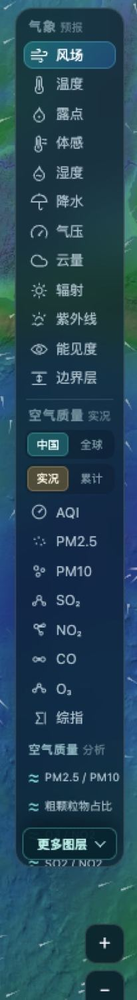
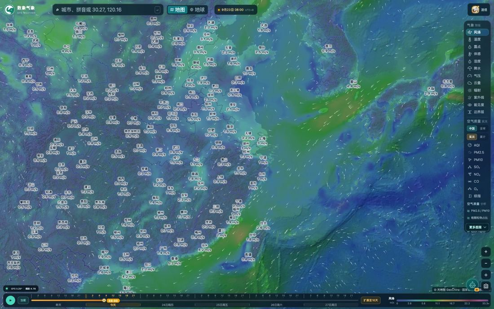
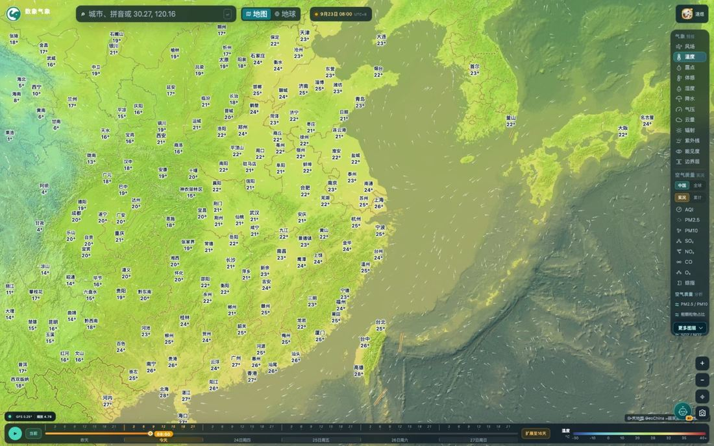
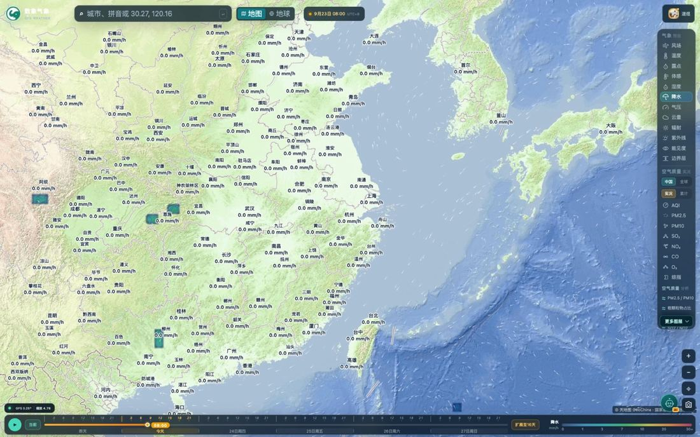
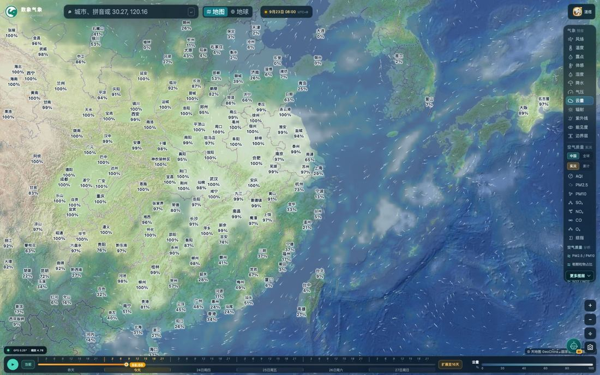
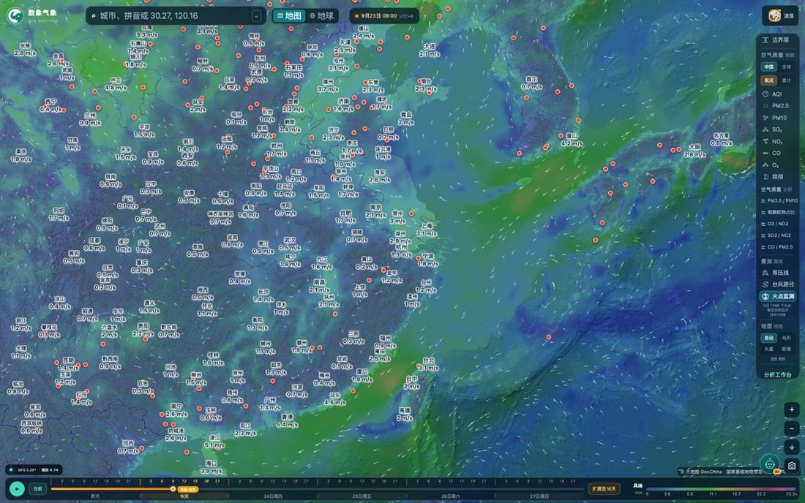

# 数象气象使用指南（一）：12 项气象图层怎么选、怎么看

> 本文是「数象气象使用指南」系列的第 1 篇，介绍首页右侧图层面板的用法。全部截图取自 <https://sxmap.zq12369.com/> 实际界面。

打开 <https://sxmap.zq12369.com/>，屏幕上分三块：**中间是地图，右侧是图层切换面板，底部是时间轴**。绝大多数操作都围绕这三块展开，先认识右侧这块面板，后面几篇的内容都会顺很多。

## 面板长什么样

把右侧面板放大来看：

面板从上到下分成四组：

| 分组 | 内容 |
| --- | --- |
| **气象预报** | 12 项气象要素 |
| **空气质量** | 数据范围（中国 / 全球）+ 8 项空气质量图层 + 5 项结构比值 |
| **叠加图层** | 等压线、台风路径、火点监测 |
| **地图底图** | 自动 / 地形 / 矢量 / 影像 |

点任意一项即可切换，被选中的那一项会高亮。

## 12 项气象要素

气象要素一共 12 项，按「看什么」可以分成四类：

**看温度类**——温度、露点、体感。温度是最常看的那个；露点反映空气里实际含了多少水汽（露点高＝闷）；体感是综合温度、湿度、风速之后的体感温度，夏天和冬天比温度更有参考价值。

**看水汽类**——湿度、降水、云量。湿度是相对湿度；降水是降水率色场，能看出雨带的位置和强弱梯度；云量适合配合云图一起判断天气系统。

**看风与气压类**——风场、气压。风场图层用流线表现风向、用颜色表现风速，是默认打开的那一层；气压配合「叠加图层」里的等压线看，高低压中心一目了然。

**看辐射与大气边界类**——辐射、紫外线、能见度、边界层。辐射是到达地表的短波辐射（光伏、晒衣物、晒被子的好帮手）；紫外线直接给出强度分布；能见度关系出行与交通；边界层高度是大气垂直混合的「盖子」，边界层低＋湿度高＝污染物容易堆积，这条在判断空气质量时特别有用。

下图是默认的风场图层：流线看风向，颜色看风速，城市标签同步给出该城市的读数。

## 换个图层看看

切到温度，色场立刻变成气温分布，图例与色阶同步换成温度档位：

切到降水，能直接看出雨带在哪、雨势有多强——这是规划出行时间窗最有用的一个图层：

切到云量，配合时间轴播放，可以看到云系的移动方向，大致推断未来一两天天气怎么变：

## 三个容易忽略的细节

**一、切换图层不会丢位置和时间。** 面板切换只换要素，当前看的地图范围、缩放级别和时间轴位置都保留。所以正确的用法是：先定位到自己关心的城市或区域，再在面板上逐个图层来回切着对比，而不是每换一个要素就重新找位置。

**二、图例就在地图右下角，而且每个图层都不一样。** 风场图例单位是 m/s，AQI 图例是 0 / 50 / 100 / 150 / 200 / 300 / 500+ 的国标档位，结构比值图例是 0.00～1.00。看色场之前先扫一眼图例，能避免「颜色差不多但其实差一个量级」的误读。

**三、叠加图层是可以组合的。** 「叠加图层」里的等压线、台风路径、火点监测可以同时打开，与任意气象图层叠加。比较有用的组合：

- 等压线 ＋ 风场：看气压场和风的对应关系，判断天气系统位置；
- 火点监测 ＋ 风场 ＋ 边界层：判断高温点周边的大气扩散条件；
- 台风路径 ＋ 降水：看台风影响范围内的雨带分布。

## 一句话总结

**先在地图上把位置定下来，再用右侧面板换要素，用底部时间轴换时刻。** 这是这个页面最省事的使用顺序。

---

**系列文章**

1. **12 项气象图层怎么选、怎么看**（本篇）
2. [空气质量怎么看：中国站点与全球模式](02-air-quality.md)
3. [五项结构比值：AQI 只回答「污染程度」](03-structure-ratios.md)
4. [台风页怎么用：多机构对比、风圈与叠加图层](04-typhoon.md)
5. [定位与时间轴：搜索、点选、经纬度与 16 天](05-find-and-time.md)
6. [地球模式与火点监测](06-globe-and-fire.md)
7. [用一句话问天气：AI 助手怎么用](07-ai-assistant.md)

[← 返回项目总览](../README.md) ｜ 在线使用：<https://sxmap.zq12369.com/>
