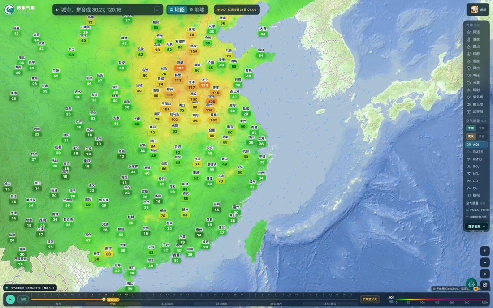
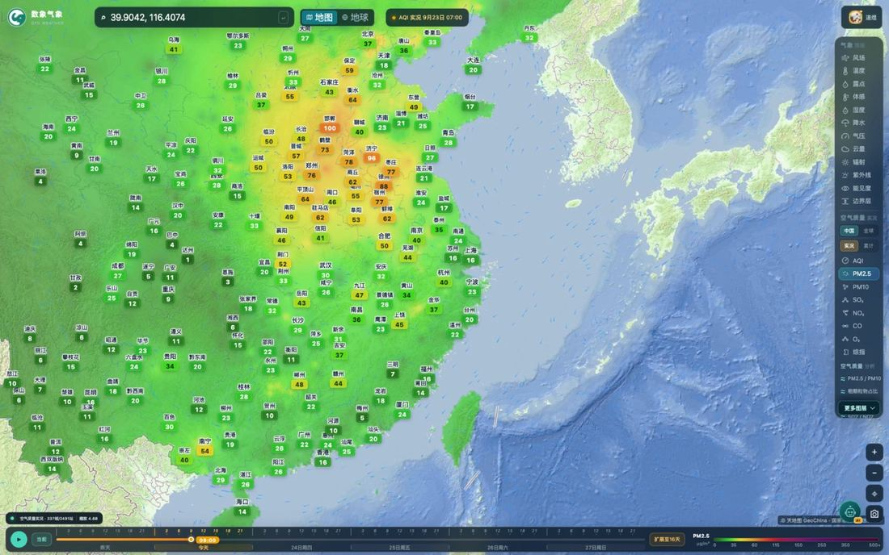
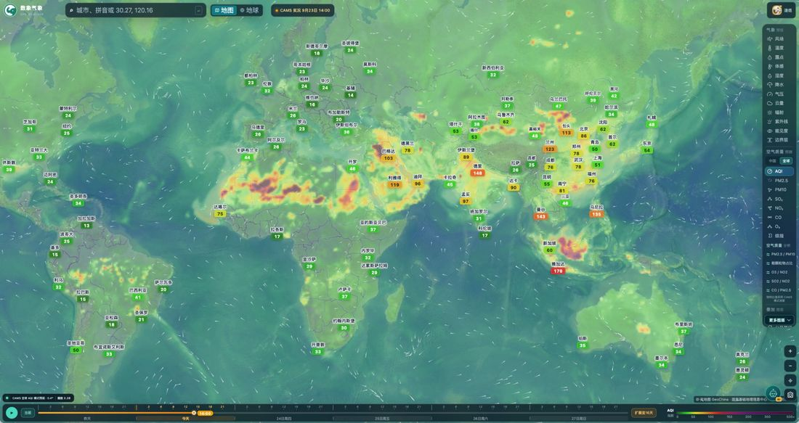
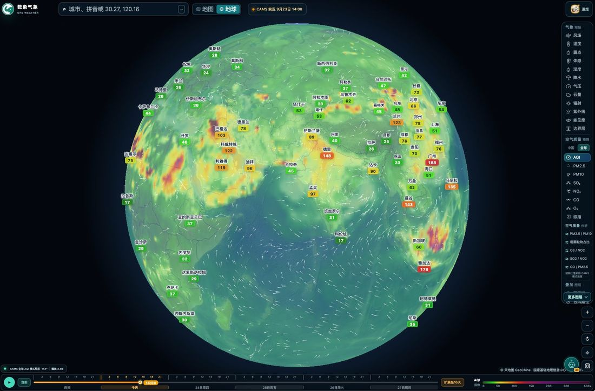

# 数象气象使用指南（二）：空气质量怎么看

> 本文是「数象气象使用指南」系列的第 2 篇，介绍空气质量图层的用法与口径。截图取自 <https://sxmap.zq12369.com/> 实际界面。

空气质量是这个平台和普通天气地图差别最大的地方，也是最容易被误读的地方。先把面板那一栏拆开看。

## 面板上的三行东西

右侧面板的「空气质量」分组里，图层下面其实压着两组开关：

**第一组：数据范围「中国 / 全球」。**

- **中国**——中国大陆站点实测数据，空间上是**基于站点的插值估算**；
- **全球**——全球模式网格（CAMS），空间上是模式场。

这两个不是「清晰度不同」，而是**两套完全不同的数据**，页面左下角会如实标注是哪一种，切换的时候留意一下。

**第二组：当前数据口径「实况 / 累计」。**

- **实况**——最新一个小时的实况发布；
- **累计**——当日累计发布口径。

这一组只在「中国」范围下出现。切到「全球」时，面板标题里的口径会变成「预测」，因为 CAMS 在全球范围给的是模式预测场。

顶部中央还会显示当前时次与口径，例如「AQI 实况 9月23日 07:00」。**看数之前先看这行字**，它能回答「我看到的是几点的数据、哪种口径」这个问题——很多空气质量地图的误读都出在这里。

## 八项图层怎么选

空气质量图层共 8 项：**AQI、PM2.5、PM10、SO₂、NO₂、CO、O₃、综指**。

用法上只需要记住：**AQI 用来看「污染到什么程度」，六项污染物用来看「主要污染物是哪一项」**。

先分清两个名字很像、算法完全不同的指标——面板上「AQI」和「综指」是两项独立图层，不是同一个东西的两种叫法：

| 维度 | AQI（空气质量指数） | 综指（环境空气质量综合指数） |
| --- | --- | --- |
| 算法 | **最大值法**——取六项污染物 IAQI（按 HJ 633 分段）的最大值 | **加权求和法**——六项污染物单项指数加权求和 |
| 关注焦点 | 最严重的那一项污染物，突出短板与突发风险 | 六项污染物的累积总量，突出综合负荷 |
| 时间尺度 | 逐小时实况、日均 | 月度、季度、年度这类较长时段 |
| 主要服务对象 | 公众：日常出行、健康防护、应急响应 | 管理部门：城市空气质量排名、考核与减排评估 |
| 取值范围 | 0～500 的分段无量纲指数 | 比值叠加、理论上无上限；本站色阶按 0～18 标定 |

**AQI 回答的是「最坏的那一项有多严重」。** 它取的是六项分指数里的最大值，所以天然只反映短板：AQI 同样都是 100，PM2.5 主导和臭氧主导在指数上看不出任何区别，必须切到六项污染物图层才知道是哪一项在顶。

**综指回答的是「整体负荷有多重」。** 它把六项浓度按统一的标准限值折算成单项指数再加权求和，任何一项偏高都会抬高整体，反映的是累积压力，适合跨城市、跨时段做横向比较；也正因为它是求和，量纲和 AQI 不是一回事，**不要拿综指的数值去和 AQI 比大小**。

所以实际用法是：

1. 先用 **AQI** 扫一遍，找出高值区；
2. 再把范围缩小到高值区，逐个切 **PM2.5 / PM10 / O₃ / NO₂**，看是哪一项在顶，也就是当前的首要污染物；
3. 想看「臭氧与氮氧化物的相对关系」，直接切到下面一组的 **O₃ / NO₂** 比值图层（见第三篇）；
4. 想比较各城市这段时间的**污染压力**，或者看月度、年度的变化，改用 **综指**。

悬浮或点击城市，标签会给该城市的浓度读数；AQI 色场用的是国标档位（0 / 50 / 100 / 150 / 200 / 300 / 500+），图例就在右下角。

## 全球范围：模式网格的另一套用法

切到「全球」，得到的是 CAMS 模式场，尺度更大、分辨率更粗，但优势是能看到**跨境传输与沙尘过程的整条链路**——这类信息在中国站点范围里是看不到的，因为站点只覆盖中国。

同一时次切到地球模式，大尺度分布一眼就能看完整：

左下角的标注会随范围变化（站点插值 vs 模式色场），两个范围的插值半径、色场分辨率都不一样，这也是为什么页面要分别标注——**不要把两个范围下的数值当作同一把尺子去比大小**。

## 一个高价值的组合：风场 ＋ 空气质量

空气质量和风场叠加着看，能区分两种完全不同的污染情形：

- **本地累积**——风速小、风向乱，污染物堆在城市周边，浓度梯度以城市为中心向外衰减；
- **上游输送**——浓度高值区呈带状，且带的方向与风向一致，顺着风往上游看能找到源区。

具体操作：切到 **AQI**，记下高值带的位置和走向；再切到 **风场**，看风的方向是不是和高值带一致。这一步用时间轴播放效果更好——拖动时间轴，看高值带是「原地不动慢慢变浓」还是「整条带子被推着走」，两种过程的判断会立刻清晰起来。

## 常见误读提醒

- **插值不等于实测**。中国范围下的色场是基于站点数据的空间估算，它告诉你「这一片大致什么水平」，不等同于你所在位置有一台监测仪。
- **AQI 是折算值，不直接等于浓度**。要看浓度切 PM2.5 / PM10 等单项图层。
- **口径要跟着看**。实况和累计两种发布口径的数值不一样，页面会标注，读数的第一时间先确认口径。
- **站点少的区域，插值参考价值下降**。页面左下角会显示参与计算的站点数量，可以据此判断可信度。

---

**系列文章**

1. [12 项气象图层怎么选、怎么看](01-weather-layers.md)
2. **空气质量怎么看：中国站点与全球模式**（本篇）
3. [五项结构比值：AQI 只回答「污染程度」](03-structure-ratios.md)
4. [台风页怎么用：多机构对比、风圈与叠加图层](04-typhoon.md)
5. [定位与时间轴：搜索、点选、经纬度与 16 天](05-find-and-time.md)
6. [地球模式与火点监测](06-globe-and-fire.md)
7. [用一句话问天气：AI 助手怎么用](07-ai-assistant.md)

[← 返回项目总览](../README.md) ｜ 在线使用：<https://sxmap.zq12369.com/>
