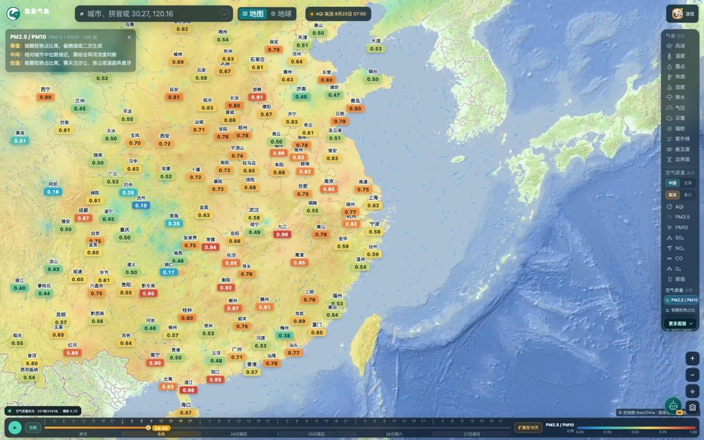
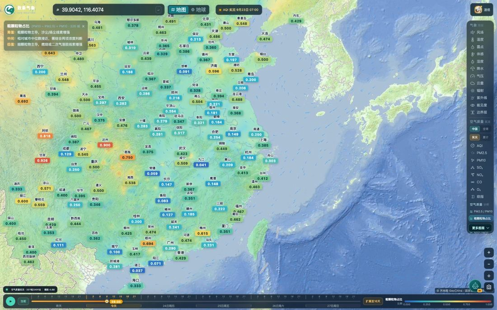

# 数象气象使用指南（三）：五项结构比值怎么读

> 本文是「数象气象使用指南」系列的第 3 篇。截图取自 <https://sxmap.zq12369.com/> 实际界面。

**AQI 只回答「污染到什么程度」，结构比值回答「污染来自哪些组分」。** 这是这项功能存在的全部理由。

面板「空气质量 · 分析」下面有五项带 `≈` 标记的图层，`≈` 表示它是由浓度算出来的**派生量**，不是一次直接观测：

| 图层 | 公式 | 参与量 |
| --- | --- | --- |
| PM2.5 / PM10 | PM2.5 ÷ PM10 | 细颗粒物占比 |
| 粗颗粒物占比 | (PM10 − PM2.5) ÷ PM10 | 粗颗粒物占比 |
| O3 / NO2 | O₃ ÷ NO₂ | 臭氧与氮氧化物之比 |
| SO2 / NO2 | SO₂ ÷ NO₂ | 硫与氮之比 |
| CO / PM2.5 | CO(μg/m³) ÷ PM2.5 | 不完全燃烧信号强度 |

## 读法：每一档都在回答「主要是哪一类」

选任一比值图层，左上角会出现一张说明卡，卡片给出**公式、参与计算的城数，以及偏高／中值／偏低三档的含义**，最后一行是口径提醒。以 PM2.5 / PM10 为例：

- **偏高**——细颗粒物占比高，偏燃烧或二次生成；
- **偏低**——粗颗粒物占比高，需关注沙尘、扬尘或道路再悬浮；
- **口径提醒**——需同时看 PM10 绝对浓度；低浓度条件下比值不稳定。

再看「粗颗粒物占比」，它的含义正好和上一项互为镜像：

**同样是「粗颗粒物占比高」，沙尘过程和道路扬尘不是一回事**——这时把风场图层打开，看高值区是否与大风区、沙源地走向一致：一致则偏沙尘输送，不一致则更可能是本地的扬尘或二次生成。

## 臭氧那一项最有时间价值

O₃ / NO₂ 是五项里对时段最敏感的一项：

- **偏高**——臭氧相对突出，可能有光化学转化或区域输送；
- **偏低**——NO₂ 相对突出，偏新鲜交通 / 燃烧排放；
- **口径**——受日照、温度、时段和边界层高度影响，**不能单独用来判定来源**。

这才是它真正的用法：**配合时间轴看一天里的走势**。把时间轴拖到午后，再看同一片区域，比例通常会明显抬升（日照最强、气温最高、边界层抬升，光化学反应最活跃）；拖到夜间再看一次，比例回落。这个「午后抬升」的日变化节奏，是臭氧污染最典型的特征。

拖动时间轴在一天之内来回对比，比看单个时刻的数值有用得多。

## 要避开的四个坑

1. **比值不能脱离绝对值看。** 极低的浓度下，分母很小，比值会出现毫无意义的剧烈跳动。页面已经做了处理——低浓度分母等异常值不参与计算——但「比值很高」本身仍不等于「污染很重」，一定要回头看一眼 PM10、PM2.5 的实际浓度。
2. **PM2.5 不应该大于 PM10。** 如果某个城市出现这种情况，说明数据本身有问题，这类异常值也不参与计算，看到缺值属于正常。
3. **SO₂ 那一项在被放大时会失真。** SO₂ 浓度接近检测下限时，比值会被放大，看到极高的 SO₂ / NO₂ 值先怀疑分母太小。
4. **CO 的单位已经换算过。** CO 原始单位是 mg/m³，计算比值前已统一换算成 μg/m³，两项口径是一致的，不要自己再折算一遍。

## 一个实用的巡检顺序

三个步骤，两三分钟能过一遍：

1. **AQI** 找出高值区；
2. 切 **PM2.5 / PM10** 看是细颗粒还是粗颗粒在顶，结合 **风场** 判断本地累积还是上游输送；
3. 如果高值区出现在**午后**，切 **O₃ / NO₂** 和 **PM2.5 / PM10** 对照，确认是臭氧主导的光化学污染；如果出现在**夜间到清晨**，多看 **CO / PM2.5**——不完全燃烧类的排放（含居民燃烧、机动车）在这两个比值上会同时抬升。

这套顺序的好处是：每一步都在排除一种可能，最后剩下的判断会具体得多，而不是「今天空气质量不好」。

---

**系列文章**

1. [12 项气象图层怎么选、怎么看](01-weather-layers.md)
2. [空气质量怎么看：中国站点与全球模式](02-air-quality.md)
3. **五项结构比值：AQI 只回答「污染程度」**（本篇）
4. [台风页怎么用：多机构对比、风圈与叠加图层](04-typhoon.md)
5. [定位与时间轴：搜索、点选、经纬度与 16 天](05-find-and-time.md)
6. [地球模式与火点监测](06-globe-and-fire.md)
7. [用一句话问天气：AI 助手怎么用](07-ai-assistant.md)

[← 返回项目总览](../README.md) ｜ 在线使用：<https://sxmap.zq12369.com/>
