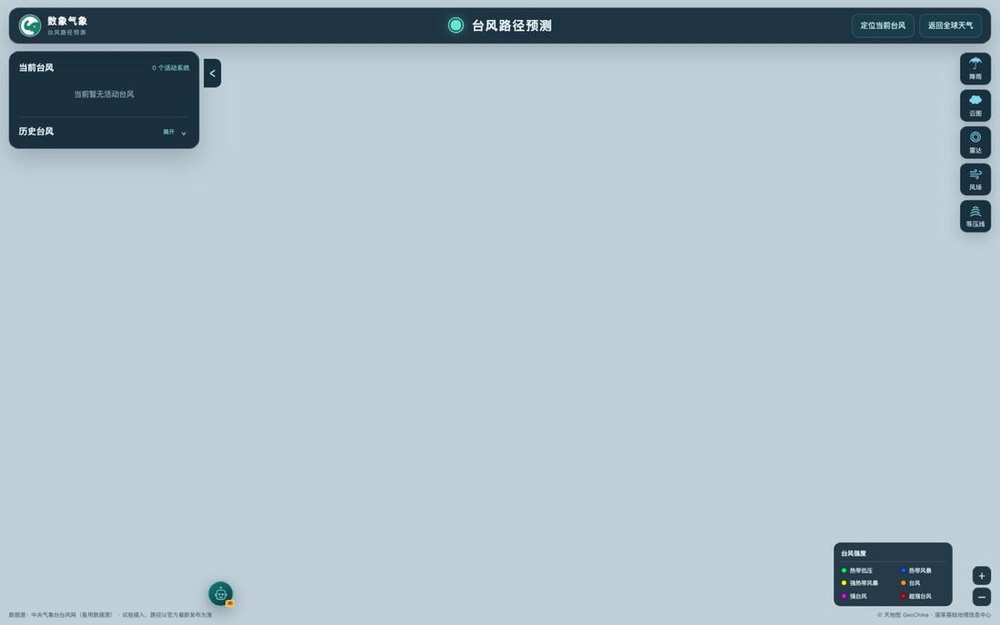
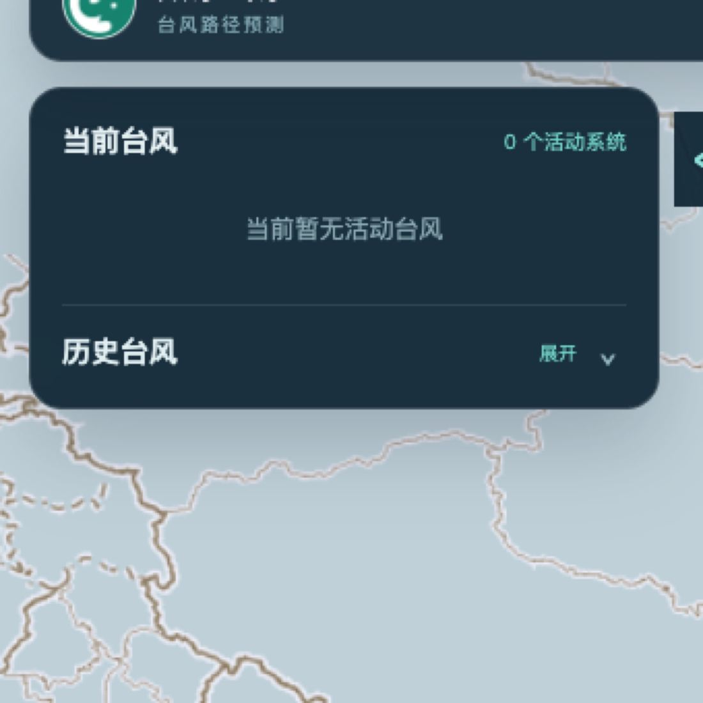
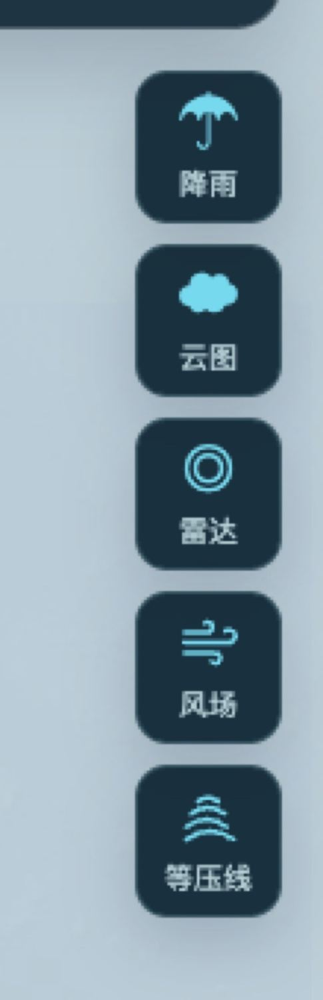
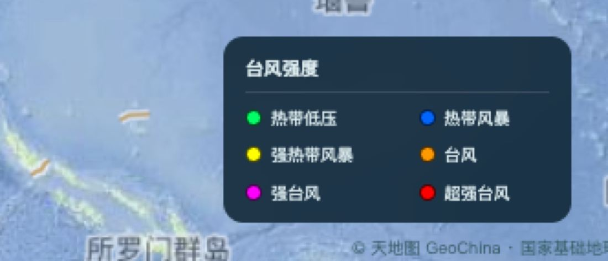

# 数象气象使用指南（四）：台风页怎么用

> 本文是「数象气象使用指南」系列的第 4 篇。截图取自 <https://sxmap.zq12369.com/typhoon> 实际界面。

台风页是一个独立页面，从首页的「叠加图层 → 台风路径」也可以一键进入。页面右上角有两个按钮：「定位当前台风」和「返回全球天气」。

页面分三部分：**左边是台风列表，右边是叠加图层开关，地图上是轨迹**。

## 左边：当前台风与历史台风

**当前台风**给出正在活动的系统数量，点开即可定位到该系统。

**历史台风**展开后可以按**名称或编号**检索，也可以按年份筛选：

- 按名称或编号：直接输入台风名或编号即可；
- 按年份：下拉里可选年份直到 2011 年。

选中任一台风后，地图上会画出它的完整实况轨迹。

## 右边：五个叠加图层

| 叠加图层 | 内容 |
| --- | --- |
| **降雨** | 未来 24 / 48 / 72 小时累计降雨等值面 |
| **云图** | 卫星云图，30 分钟与 1 / 3 / 6 小时时段 |
| **雷达** | 最新雷达拼图 |
| **风场** | 基于 GFS 的风速插值色场与粒子风场 |
| **等压线** | 等压线 |

这五个可以按需组合，而且**降雨、云图、雷达并不只对台风有用**——平时想确认一场雨的实际落区，它们同样是很好的交叉验证工具：预报说有大雨，但雷达拼图上是空的，就该多留一个心眼。

## 地图上你要看的三样东西

**一、实况轨迹按强度着色。** 底部的强度图例就是配色尺：

从热带低压（绿）、热带风暴（蓝）、强热带风暴（黄）、台风（橙）、强台风（粉）到超强台风（红），轨迹线本身就用颜色标出了这个系统一路上的强度演变——**一眼就能看出它是增强还是衰减**，而不需要去查逐点数据。

**二、多机构预报路径按机构着色。** 中国、中国香港、中国台湾、日本、美国等机构的预报路径分别用不同颜色画出来，逐点可以查各机构的落区、时间与强度。各家分歧一眼可见——这正是路径预报最该看的部分：如果几家机构的路径紧紧抱在一起，说明预报可信度较高；如果散成一个「扇形」，说明不确定性大，此时距离发报时间越远分歧越大。

**三、风圈比路径中心更值得看。** 页面显示 7 级、10 级、12 级风圈，也就是各级风力实际影响到的范围。对沿海与海上作业来说，**致灾的从来不是那条路径中心线，而是风圈覆盖到的地方**——路径中心偏了一百公里，可能只是擦过；但风圈半径三百公里，风雨照样到位。

## 一个容易踩的预期差

台风页的路径、云图、雷达与降雨数据来自**浙江省水利厅台风路径发布系统**，经服务端代理获取；台风路径另有**中央气象台台风网**作为备用数据源。页脚会明确标注当前的取数来源与「试验接入」字样。

这意味着两件事：

1. **路径以官方最新发布为准。** 页面上的任何一条预报路径都是各机构公开发布的预报，不是这个平台自己的预测，请以官方发布为准。
2. **数据源偶尔会不可用。** 上游是试验性接入，上游波动时页面可能出现「暂无活动台风」或叠加图层加载不出来的情况；这种情况先对照官方发布确认，不要据此判断「没有台风」。**西北太平洋在非台风季本来就常常是 0 个活动系统，页面会如实显示。**

## 顺手一提：台风页也有 AI 助手

右下角同样有 AI 入口，而且它会**直接操作这一页**：选中活动或历史台风、开关累计降雨 / 卫星云图 / 雷达 / 风场 / 等压线，再取实况与多机构预测路径作答。适合「现在这个台风对浙江的影响主要在什么时候」这类需要跨要素汇总的问题。用法见系列第 7 篇。

---

**系列文章**

1. [12 项气象图层怎么选、怎么看](01-weather-layers.md)
2. [空气质量怎么看：中国站点与全球模式](02-air-quality.md)
3. [五项结构比值：AQI 只回答「污染程度」](03-structure-ratios.md)
4. **台风页怎么用：多机构对比、风圈与叠加图层**（本篇）
5. [定位与时间轴：搜索、点选、经纬度与 16 天](05-find-and-time.md)
6. [地球模式](06-globe.md)
7. [火点监测：当日地表高温点的读法](07-fire.md)
8. [用一句话问天气：AI 助手怎么用](08-ai-assistant.md)

[← 返回项目总览](../README.md) ｜ 台风页：<https://sxmap.zq12369.com/typhoon>
