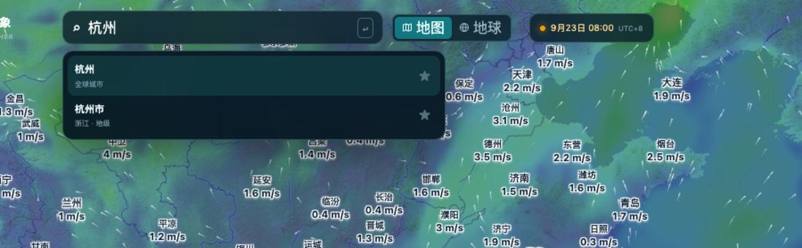
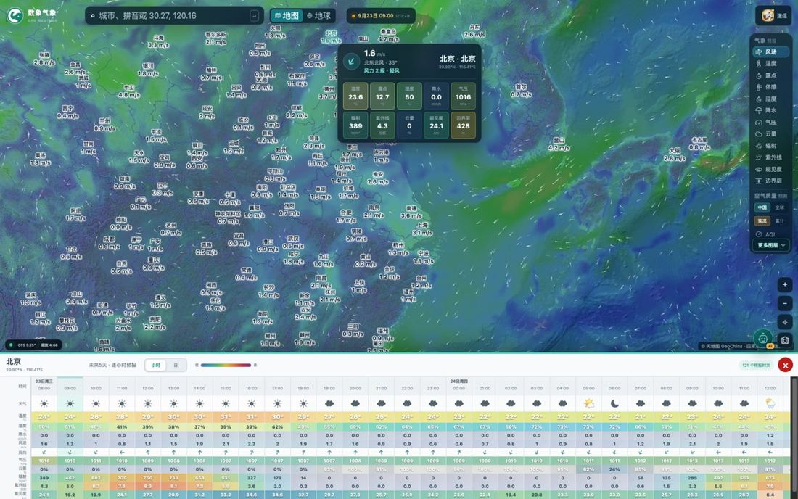
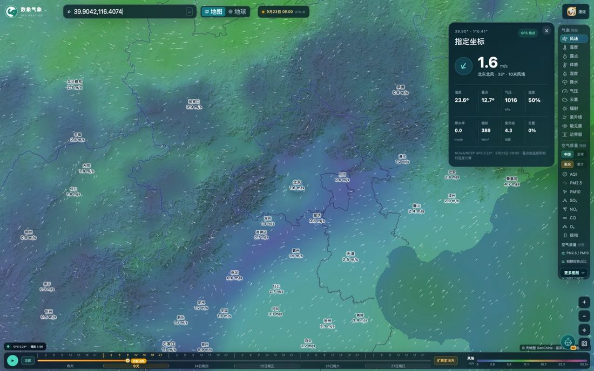
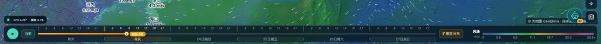
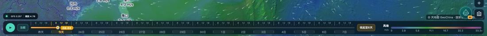

# 数象气象使用指南（五）：定位与时间轴

> 本文是「数象气象使用指南」系列的第 5 篇。截图取自 <https://sxmap.zq12369.com/> 实际界面。

前面几篇都在讲「看什么」，这篇讲「看哪里」和「看几点」。这两件事分别由顶部的搜索框和底部的时间轴负责，也是这个页面里最值得先练熟的两个操作。

## 定位：三种方式，各管一段

### 方式一：按名称或拼音搜索

顶部搜索框支持**城市名、拼音**：

下拉结果会标出类型——「全球城市」和「浙江 · 地级」是两类不同的数据源，精度和覆盖对象不一样；右侧星标可以收藏常用地点，下次直接取用。

把范围放宽到**区县**也能查，这是它比多数天气 App 更有用的一点：很多天气过程在市级尺度上是平均掉的，区县层面才看得出差异。

### 方式二：直接在地图上点

地图上的城市标签本身可以点（鼠标悬停会提示「查看 XX 未来预报」），点开后弹出该点的读数卡片，并在底部展开**未来 5 天逐小时预报表**：

表里可以切换**小时 / 日**两种粒度，底部会显示参与汇总的预报批次数。逐小时表一行横着铺开的要素有：天气、温度、湿度、降水、风速、风向、气压、辐射、紫外线、云量、能见度、边界层——**挑作业时间窗的时候，一眼横着扫过去比挨个点开图表快得多**。

点地图上任意非城市位置同样可以取数，这正是下一个方式。

### 方式三：输入经纬度，落到具体坐标

在搜索框里直接输入坐标（**纬度,经度**，例如 `39.9042,116.4074`），回车即定位。这种方式的价值在于**城市之外的位置**：项目所在地、园区周边、郊野、沿途路段。

得到的是标注为「**指定坐标 · GFS 格点**」的读数：风、温度、露点、气压、湿度、降水率、辐射、紫外线、云量，卡片底部注明格点分辨率与取值时刻。定位后地图会显示对应的**行政区划边界**，方便确认这个坐标归哪里管。

> 提示：坐标模式下读到的是**最近格点的插值取值**，不是该坐标上的实测站数据——城市平均值之外的空间差异能看到趋势，但不要把它当成一块地的现场测量。

## 时间轴：先搞清两条规则

底部时间轴从左到右依次是：**播放按钮、当前、可拖动的刻度条、日期按钮、扩展按钮**。

**规则一：默认窗口是北京时间昨日 00:00 起 6 天（昨天 + 今天起 5 天），逐小时。** 之所以从昨天开始而不是从今天开始，是为了能往回看一天——判断「这场雨是从什么时候开始下的」，比只看未来更需要昨天那一段。

**规则二：点「扩展至16天」后，第 7 天起回落到 3 小时间隔。**

这不是缩水，而是**数据本身的时间分辨率决定的**：越往远期，可用时次本来就稀疏，硬撑逐小时只会给出虚假的精度。所以近端逐小时看过程，远端按 3 小时看趋势，是合理的用法切换。按钮会变成「收起至6天」，随时切回来。

## 三个操作技巧

**一、播放按钮比拖动更好用。** 想看清一次天气过程的移动方向，点播放让它自己跑一遍，比手动拖十几格要直观得多。看雨带推进、看污染物输送、看云系移动，都推荐先播放一遍。

**二、用键盘逐格微调。** 时间轴滑块聚焦后，**左右方向键可以按合法时次逐格移动**——需要精确到某一小时的时候，比用鼠标拖准得多。

**三、日期按钮负责跳，刻度条负责找。** 「昨天 / 今天 / 25日周五」这类按钮用来跨天跳转，跨天之后再在刻度条上找具体小时，两段式操作最快。

## 和前面几篇的配合

- 找位置 → 切图层（第 1 篇）；
- 找位置 → 看空气质量口径与结构比值（第 2、3 篇）；
- 拖动时间轴 → 看臭氧的日变化（第 3 篇）；
- 拖动时间轴 → 看高值带是「原地累积」还是「被风推着走」（第 2 篇）。

会发现这个页面的核心操作其实就是两个维度：**空间上用定位，时间上用时间轴**，其余都是在这两个维度上换要素。

---

**系列文章**

1. [12 项气象图层怎么选、怎么看](01-weather-layers.md)
2. [空气质量怎么看：中国站点与全球模式](02-air-quality.md)
3. [五项结构比值：AQI 只回答「有多脏」](03-structure-ratios.md)
4. [台风页怎么用：多机构对比、风圈与叠加图层](04-typhoon.md)
5. **定位与时间轴：搜索、点选、经纬度与 16 天**（本篇）
6. [地球模式与火点监测](06-globe-and-fire.md)
7. [用一句话问天气：AI 助手怎么用](07-ai-assistant.md)

[← 返回项目总览](../README.md) ｜ 在线使用：<https://sxmap.zq12369.com/>
