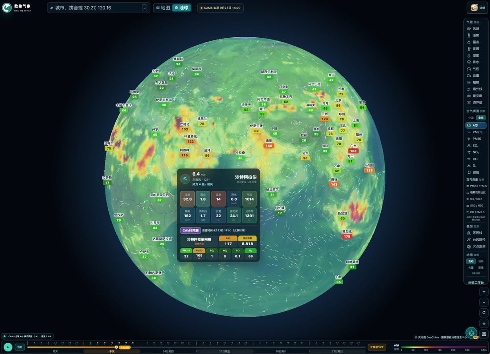

# 数象气象使用指南（六）：地球模式

> 本文是「数象气象使用指南」系列的第 6 篇。截图取自 <https://sxmap.zq12369.com/> 实际界面。

前面几篇都在平面地图上操作。这篇只讲一件事：**把地图切成球面看环流**。

## 地球模式：看环流走向的正确尺度

顶栏「地图 / 地球」一键切换。切过去之后，全球色场被贴到一个球面上，风场以流线方式连续呈现——**注意，是连续的**：平面投影在球面展开时会在地图边缘出现变形和断裂，环流看起来会被「切开」，而球面视图能让你跟住一条完整的水汽输送路径。

**它适合解决的问题和平面地图不一样：**

| 想解决的问题 | 用什么视角 |
| --- | --- |
| 某个城市明天要不要带伞 | 平面地图，定位到城市 |
| 这次冷空气从哪来、到哪去 | **地球模式** |
| 水汽是从哪个海区输送过来的 | **地球模式** |
| 台风外围环流会影响到哪些区域 | **地球模式** |
| 污染物在这条输送带上到哪了 | **地球模式**，再用时间轴播放 |

用法上就一句话：**先在球面上顺着流线看清整条通道，再切回平面地图，把镜头落到通道上的具体城市看读数。** 两种视角来回切，不要只用一个。

## 切的是投影，不是图层

图层面板在地球模式下完全一样——12 项气象要素、空气质量、结构比值、叠加图层都能用，切投影不会退出球面视图，也不会丢掉当前选中的图层。**空气质量放到球面上看尤其合适**：切到 AQI 之后，跨境输送的带状结构直接铺在整个球面上，不用在地图边缘做心算拼接，哪一条沙尘带连着哪一片高值区一眼就能跟下来。

球面视图上的取数方式和平面地图一致：随手点一处网格，悬浮卡给出该点的六项污染物与 AQI 读数。

**有一件事要留意**——上图这一档取的是全球 CAMS 模式（顶栏标注「CAMS 实况」），读数是模式网格值；要看中国境内的地面站点实测，得把范围开关切回「中国」。两套口径的区别见第二篇。

## 底图也可以换

面板最后一组是「地图底图」：**自动 / 地形 / 矢量 / 影像**，面板会提示当前实际生效的是哪一档（例如「当前 地形」）。

- **地形**——看山脉走向与地形起伏，判断地形对降水与风的抬升作用；
- **矢量**——干净、路网清晰，适合看城市与行政边界；
- **影像**——卫星影像底图，颜色偏深，看地表覆盖与海岸线更直观；
- **自动**——按当前情况自动选择，日常用这个就行。

## 顺手一提：截图分享

页面右下角有个「**截图分享**」按钮，作用是**复制一张带二维码的地图图片**到剪贴板——当前视角、当前图层、当前时间轴位置都会被拍进去。

这个功能在两种场景下特别省事：一是写材料、做汇报时需要一张「此刻的天气图」，直接粘贴即可，不用自己去截图裁边；二是把某个位置的情况发给同事，对方扫码就能在手机上打开同一片区域。

---

**系列文章**

1. [12 项气象图层怎么选、怎么看](01-weather-layers.md)
2. [空气质量怎么看：中国站点与全球模式](02-air-quality.md)
3. [五项结构比值：AQI 只回答「污染程度」](03-structure-ratios.md)
4. [台风页怎么用：多机构对比、风圈与叠加图层](04-typhoon.md)
5. [定位与时间轴：搜索、点选、经纬度与 16 天](05-find-and-time.md)
6. **地球模式**（本篇）
7. [火点监测：当日地表高温点的读法](07-fire.md)
8. [用一句话问天气：AI 助手怎么用](08-ai-assistant.md)

[← 返回项目总览](../README.md) ｜ 在线使用：<https://sxmap.zq12369.com/>
