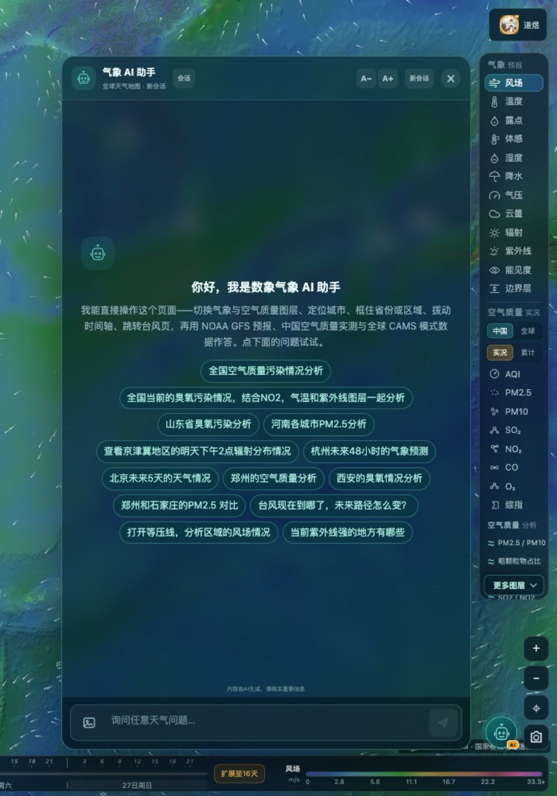
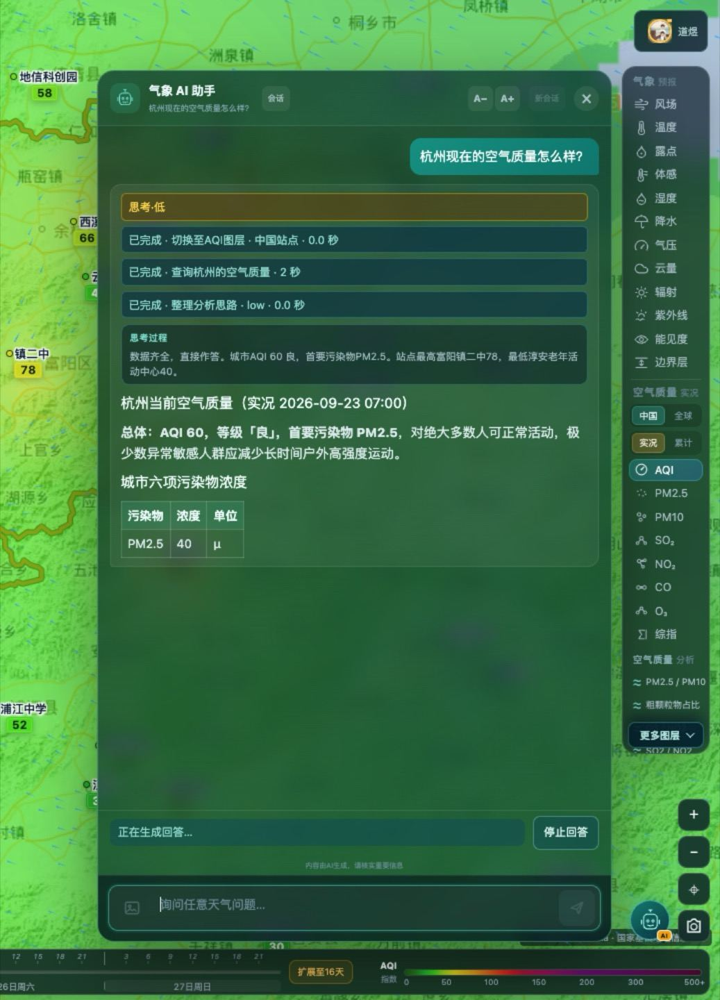
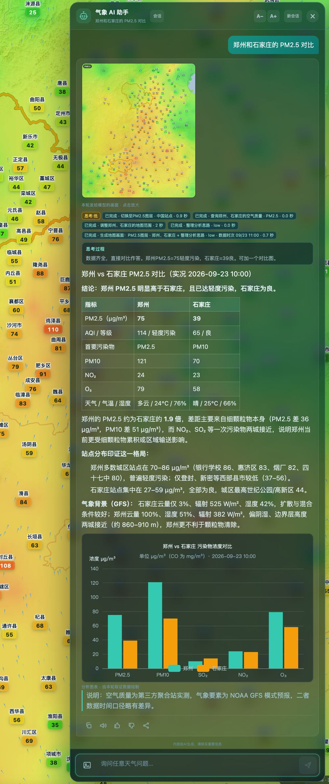
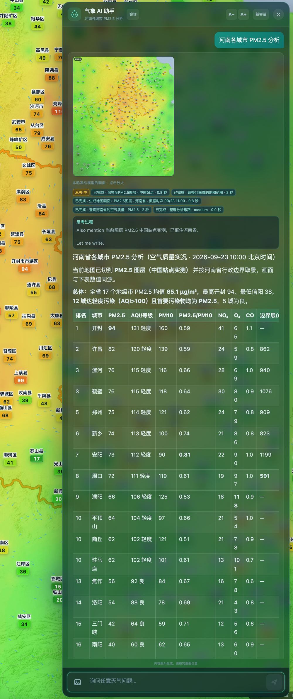
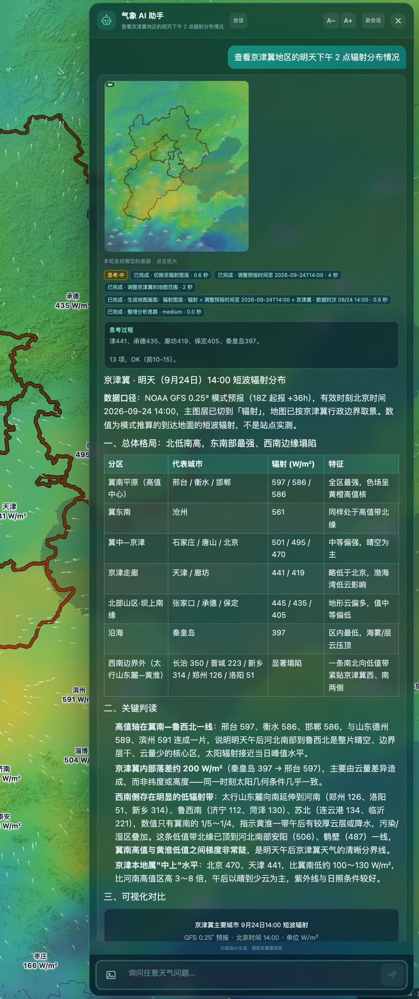
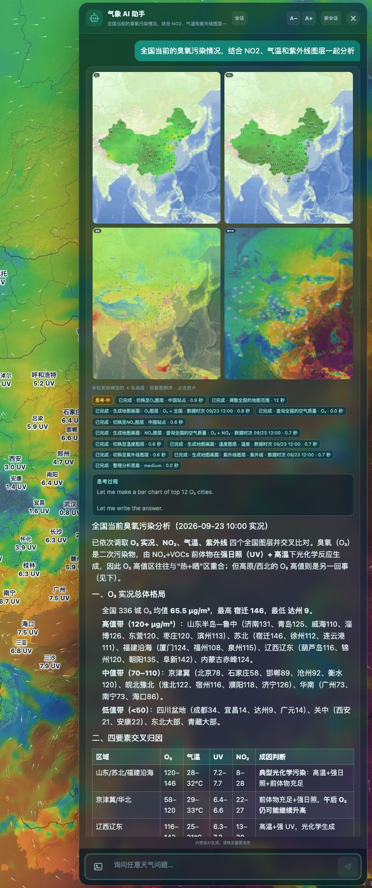

# 数象气象使用指南（七）：用一句话问天气，AI 助手怎么用

> 本文是「数象气象使用指南」系列的第 7 篇。截图取自 <https://sxmap.zq12369.com/> 实际界面。

前六篇讲的都是「在哪点、点什么」。这一篇讲另一种用法：**不用自己找图层，直接用一句话问。**

入口在地图右下角的「**AI**」按钮，点击后从右侧滑出对话面板。



## 它和普通聊天机器人的区别

看欢迎语里那句关键的话——它说的是「**我能直接操作这个页面**」：

> 切换气象与空气质量图层、定位城市、框住省份或区域、拨动时间轴、跳转台风页，再用 NOAA GFS 预报、中国空气质量实测与全球 CAMS 模式数据作答。

也就是说，它不是一个在旁边聊天的窗口，而是**一个能替你操作地图的入口**。这件事在实测里看得很清楚：问一句「杭州现在的空气质量怎么样？」，它会先切到 AQI 图层、把地图定位到杭州，再取数作答：



注意回答上方那个「**思考过程**」区域，它把中间步骤都摊开了：

```
已完成 · 切换至 AQI 图层 · 中国站点 · 0.0 秒
已完成 · 查询杭州的空气质量 · 2 秒
已完成 · 整理分析思路 · low
```

这一点很值得单独说：**它把「调了什么、查了哪个口径」写在明面上**，所以你能核对结论是不是基于你想要的那份数据（例如是不是「中国站点」口径），而不是只能选择信或不信。答完之后地图还停在它切过去的那一层，可以接着自己点、自己切——**AI 负责把镜头摆好，细看还是你自己来更快**。

回答本身是结论式的：先给总体判断（AQI 数值、等级、首要污染物、对哪些人群有影响），再跟一张分项表（城市六项污染物浓度），适合直接摘取。

## 提问的三个要素

它听得懂自然语言，但把三件事说清楚，答案会准得多：

**要素**——问温度、降水、风、空气质量还是紫外线。不说的话它会自己判断，但显式说出来更稳。

**地点**——城市、省份、区域（京津冀、长三角）都可以，也可以按「全国」问。它支持在图上描出行政边界，所以「山东省」这类省级问题能得到省级视野。

**时间**——这是最容易被省掉、又最影响答案的一项。「今天」「明天下午 2 点」「未来 48 小时」「最近 30 天」是四类完全不同的口径，含糊提问很容易拿到你不想要的那个时段。

欢迎页给的示例问题基本就是这个结构，可以直接点着试：**「查看京津冀地区的明天下午 2 点辐射分布情况」**（要素＋区域＋精确时刻）、**「杭州未来 48 小时的天气预测」**（要素宽泛＋地点＋时段）、**「郑州和石家庄的 PM2.5 对比」**（多地点对比）。

值得留意的是里面几条**跨要素**的问题，例如「全国当前的臭氧污染情况，结合 NO2、气温和紫外线图层一起分析」——这种需要同时取多份数据、再自己交叉判断的活儿，本来就是人工操作最费时的部分，交出去很划算。

## 三种高价值用法

**一、批量与排名。** 「河南各城市 PM2.5 分析」「当前紫外线强的地方有哪些」这类问题，手动做要一个个点过去，交给它只需要一句话。

**二、多要素联动判断。** 「结合风场和边界层看污染扩散条件」这种问题，本质上是几步图层切换加上一次交叉推理，正好是它能做的。

**三、多地点对比。** 「郑州和石家庄的 PM2.5 对比」——把两个地点放在同一次回答里给结论，比来回切换各自看一遍更省事。

## 四个实测场景

下面四段的提问都只有一句话，截图是**回答完成后的实际界面**。看的时候不用只看结论：每张图上半部分是它替你做掉的动作（思考过程里逐条写着切了哪个图层、查了哪份数据、耗时多久），下半部分才是结论与数据表。

### 场景一：两个城市横向对比

问「**郑州和石家庄的 PM2.5 对比**」。不需要交代用哪个图层——它自己切到 PM2.5、把两个城市定位好，再给对比图与结论表：



### 场景二：一个省的城市排名

问「**河南各城市 PM2.5 分析**」。返回 16 个地级市的逐行排名（AQI、等级、PM2.5、PM10、NO₂、O₃、CO 与边界层高度），开头先给一句能直接引用的总体判断——「全省 17 个地级市 PM2.5 均值 65.1 µg/m³，最高开封 94、最低信阳 38」：



### 场景三：区域 ＋ 精确时刻

问「**查看京津冀地区的明天下午 2 点辐射分布情况**」。它把「明天下午 2 点」解析成北京时 14:00 并标明数据口径（GFS 0.25° 模式预报，起报 08Z ＋36 小时），再按分区给出辐射值、写出关键判读：



### 场景四：跨要素联动

问「**全国当前的臭氧污染情况，结合 NO2、气温和紫外线图层一起分析**」。这类问题要取四份数据再交叉判断，正好是人工操作最费时的部分。截图里的思考过程能看到它依次「打开 O₃ 图层」「生成地图画面」「切换到温度图层」「切换到紫外线图层」，每张图都出一次，最后才给结论：



四张图里的「思考过程」都是可回溯的：调了哪个图层、用的是中国站点还是全球模式口径、数据时次是哪一刻，都写在明面上。结论和你的预期不一致时，先看这一段，比重新问一遍更快。

## 台风页上的 AI 是另一个能力集

台风页右下角也有同一个入口，但能力不同：**它操作的是台风页**——选中活动或历史台风、开关累计降雨 / 卫星云图 / 雷达 / 风场 / 等压线，再取实况与多机构预测路径作答。所以问台风相关的问题时，**建议直接打开台风页再问**，答完地图也停在那页，接着看风圈和叠加图层正合适。

## 三条使用提醒

1. **它是会员能力。** 地图查询本身无需注册即可体验，AI 助手属于会员能力的部分，具体权益以官网页面实时展示为准。
2. **回答可以核。** 每条回答支持复制、语音播报与分享链接；拿不准的时候，回头看「思考过程」里调了什么口径、再自己在地图上对一遍，是最快的验证方式。
3. **内容由 AI 生成，重要信息请核实。** 面板页脚就写着这句话。用于日常判断足够，用于正式决策请以官方发布的预报、预警为准。

---

**系列文章**

1. [12 项气象图层怎么选、怎么看](01-weather-layers.md)
2. [空气质量怎么看：中国站点与全球模式](02-air-quality.md)
3. [五项结构比值：AQI 只回答「有多脏」](03-structure-ratios.md)
4. [台风页怎么用：多机构对比、风圈与叠加图层](04-typhoon.md)
5. [定位与时间轴：搜索、点选、经纬度与 16 天](05-find-and-time.md)
6. [地球模式与火点监测](06-globe-and-fire.md)
7. **用一句话问天气：AI 助手怎么用**（本篇）

[← 返回项目总览](../README.md) ｜ 在线使用：<https://sxmap.zq12369.com/>
