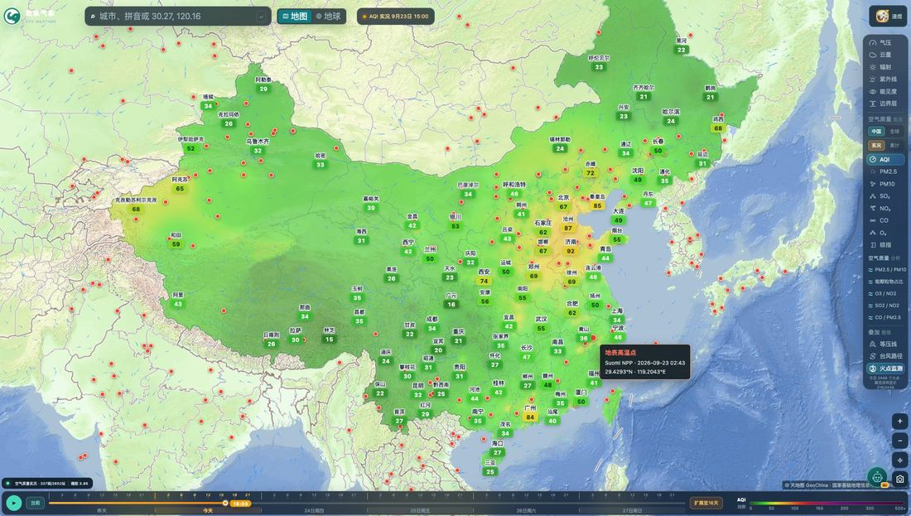
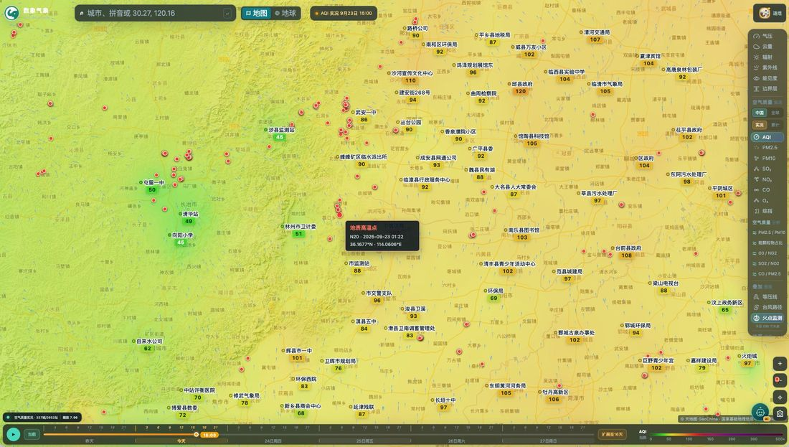

# 数象气象使用指南（七）：火点监测

> 本文是「数象气象使用指南」系列的第 7 篇。截图取自 <https://sxmap.zq12369.com/> 实际界面。

火点监测叠的是**当日地表高温点**。它不是火灾地图，更适合当成一个「大气扩散条件」的输入来看——单个点位说明不了什么，叠上风与边界层才有意义。

## 两个尺度：全国看分布，局部看点位

在图层面板的「叠加图层」里打开**火点监测**，当日的地表高温点会按当前地图视野叠加显示，都是醒目的橙色点。

它有两个用法完全不同的尺度，建议按这个顺序看。

**先看全国尺度**，用来判断今天的高温点集中在哪一带：

这个尺度下点位是按视野概览采样的（面板会标注「概览采样显示 x/y」），目的是让你看清分布形态与密度带，而不是让你逐点数。**只看到这一层就下结论会出错**——密集的橙色点里大部分是采样点，不等同于真实点位数。

**再放大到局部尺度**，逐个点位看：

放大到县市一级之后，点位回到逐个显示，配合底下的站点读数就能看出这片区域是什么背景——上图是一片 AQI 80～105 的污染区，同样的火点落在洁净背景里和落在不洁净背景里，意义并不一样。

**所以正确顺序是：先放大到关心的区域，再打开火点图层。**

## 悬浮看明细

悬停单点会给出卫星编号、过境时间与坐标，例如「地表高温点 · N20 · 2026-09-23 01:22 · 32.8771°N 114.6596°E」。

这三个字段各有各的用处：

- **卫星编号**说明数据来自哪一颗极轨卫星（`N20` 即 NOAA-20），不同卫星的重访时间与传感器分辨率不同；
- **过境时间**能区分是白天的还是夜间的过境——白天过境更容易被云遮挡而漏判；
- **坐标**用来落到具体行政区，好去对照官方发布。

## 最有价值的用法是叠加着看

单独一个火点说明不了什么，把它和大气条件叠起来才有意义：

- 火点 ＋ **风场**：看风往哪吹，判断烟羽扩散方向；
- 火点 ＋ **湿度**：干燥条件下更容易蔓延；
- 火点 ＋ **边界层**：边界层高度决定烟尘能不能向上扩散——边界层低，烟尘就压在近地面。

三者叠加以后，你得到的不再是「这里有个热点」，而是「这个热点周边的大气条件是利于扩散还是利于累积」。

## 口径要记住

点位只是**地表高温提示**，不等同于已核实的火灾范围、燃烧类型或灾情。数据来自地表高温点监测系统（中国科学院空天信息创新研究院），当日数据。看到点位请以官方发布的火情通报为准。

---

**系列文章**

1. [12 项气象图层怎么选、怎么看](01-weather-layers.md)
2. [空气质量怎么看：中国站点与全球模式](02-air-quality.md)
3. [五项结构比值：AQI 只回答「污染程度」](03-structure-ratios.md)
4. [台风页怎么用：多机构对比、风圈与叠加图层](04-typhoon.md)
5. [定位与时间轴：搜索、点选、经纬度与 16 天](05-find-and-time.md)
6. [地球模式](06-globe.md)
7. **火点监测：当日地表高温点的读法**（本篇）
8. [用一句话问天气：AI 助手怎么用](08-ai-assistant.md)

[← 返回项目总览](../README.md) ｜ 在线使用：<https://sxmap.zq12369.com/>
